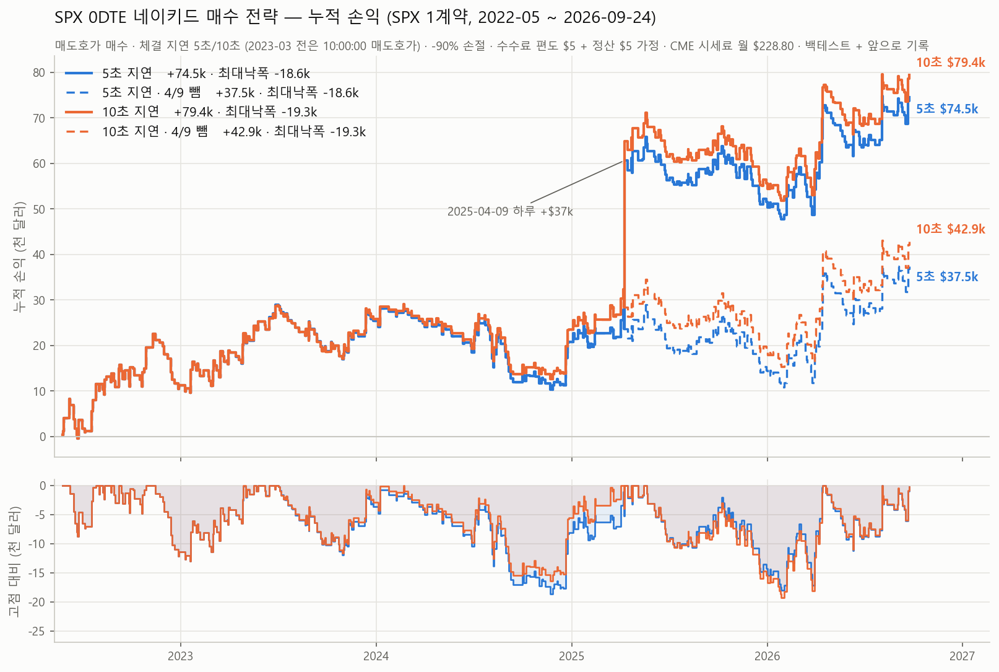
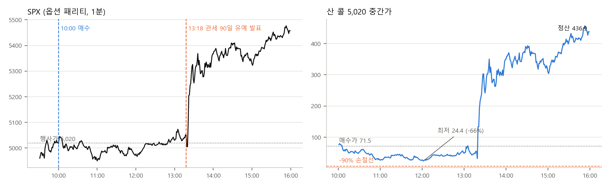
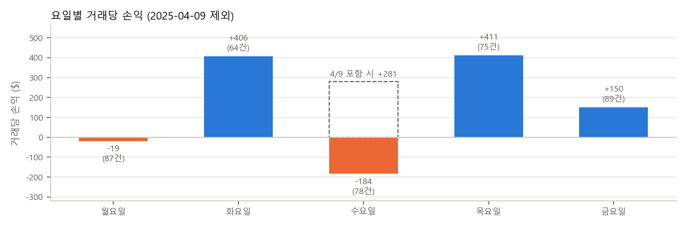

# SPX 0DTE 네이키드 매수 전략 백테스트

S&P500 지수(SPX) 당일 만기(0DTE) 옵션을 매수만 하는 규칙을 옵션 1분·초 단위 호가로 백테스트한 코드입니다.



| 매매 수 | 총손익 (1계약) | 연평균 | 최대낙폭 | 승률 |
|---|---|---|---|---|
| 395건 | +$74.5k ~ +$79.4k | +$17.2k ~ +$18.3k | −$18.6k ~ −$19.3k | 41% |

기간은 2022-05-16 ~ 2026-09-24이고, 범위는 체결 지연 5초 ~ 10초 기준입니다. NH선물 수수료(계약당 $5)와 나스닥 선물 시세 이용료(CME, 월 $228.80)를 뺀 값입니다. 자세한 내용은 [분석 보고서(PDF)](docs/SPX0DTE_naked_call_backtest.pdf)에 있습니다.

## 매매 규칙

| | |
|---|---|
| 판단 | 뉴욕 10:00:00 |
| 조건 1 | SPX 10:00:00 가격 > 09:31:00 가격 |
| 조건 2 | 나스닥100 마이크로 선물(MNQ) 5분봉(09:55~10:00) 종가 > 일목균형표 구름 윗선 (9, 26, 52) |
| 매수 | SPX 0DTE 등가격 콜 1계약, 매도호가. 미체결 시 매초 매도호가로 재주문 |
| 청산 | 초 단위 호가 중간값이 매수가 대비 −90%가 되면 바로 손절(마감 직전 포함), 아니면 16:00 SPX 종가로 현금정산 |
| 기타 | 하루 1번, 장중 추가 매수 없음 |

## 결과

체결 가정별 총손익 (394건, 2026-09-23까지)

| 매수 가격 | −90% 손절 | 손절 없음 |
|---|---|---|
| 10:00:00 매도호가 (지연 없음) | +$81.3k | +$78.2k |
| 5초 뒤 매도호가 | +$73.7k | +$70.4k |
| 10초 뒤 매도호가 | +$78.7k | +$75.7k |

- 10:00:00 직후 1~5초 동안 매도호가가 평균 1~2% 올랐다가 10초쯤 돌아옵니다. 10시 경제지표 발표(특히 ISM 서비스업) 때문이고, 그래서 10초 지연이 5초보다 조금 낫습니다.
- −90% 손절은 모든 지연 조건에서 만기까지 들고 가는 것보다 나았습니다. 0으로 끝날 콜의 남은 가치를 회수하기 때문입니다.
- 초 단위 호가는 2023-03-28부터 있습니다. 그 전 75건은 지연 없이 10:00:00 매도호가로 사고, 손절은 1분 중간가로 판정했습니다. 그 뒤는 손절도 초 단위 중간가로 판정합니다.

연도별 (10초 지연)

| 2022 (5월~) | 2023 | 2024 | 2025 | 2026 (9/24까지) |
|---|---|---|---|---|
| +$11.2k | +$14.6k | −$2.3k | +$32.1k | +$23.8k |

2025-04-09 (관세 유예 발표일): 한 건에 +$36,530(매수 금액 대비 +511%)으로 전체 이익의 약 40%입니다. 10시 판단과 상관없는 13:18 발표에서 나온 이익이라 이날을 뺀 결과(+$42.9k)도 같이 봤습니다. 매일 매수와 비교한 규칙의 우위(+$105.5k)는 이날을 넣든 빼든 같습니다.



요일별: 2025-04-09(수요일) 한 건을 빼면 수요일이 거래당 −$184로 가장 나쁩니다. 이 한 건을 넣으면 +$281이 됩니다. FOMC와 CPI가 수요일에 많고, 이벤트가 없는 수요일도 오후까지 오른 비율이 50%로 다른 요일(60~63%)보다 낮습니다. 통계적으로 확정할 수준은 아니어서 규칙은 그대로 두었습니다.



## 한계

- 4.3년, 약 400건입니다. 이익이 몇몇 큰 날에 몰려 있어서 요일마다 상위 3건(전체의 4%)을 빼면 손실입니다. 거래당 표준편차가 약 $2,600이라 우위를 통계적으로 확인하려면 몇 년이 더 필요합니다.
- 규칙은 약 1,600개 조합을 시험하면서 골랐습니다. 실제 기대치는 백테스트보다 낮게 봐야 합니다.
- 거래 순서를 바꿔 5,000번 다시 계산하면 최대낙폭 중앙값이 −$25.5k로 실제(−$19.3k)보다 큽니다.
- 2026-09-24부터 매일 새 데이터로 판단과 손익을 기록하고 있습니다 (`scripts/40_forward_log.py`).

## 방법

- SPX 가격: 옵션 풋콜 패리티 $F = K + C - P$ 로 계산했습니다 (|C−P|가 가장 작은 행사가 5개의 중앙값). 만기가 당일이라 할인·배당 효과는 0.2pt 이하여서 뺐습니다. 실제 지수와 분 단위 차이는 중앙값 0.35pt입니다.
- 체결: 매수는 5·10초 뒤 매도호가, 손절은 초 단위 중간가가 −90%에 닿은 다음 초의 매수호가, 만기는 16:00 SPX 종가 현금정산입니다.
- 판단에는 10:00:00까지 확정된 값(SPX 10:00:00, MNQ 09:55 5분봉)만 씁니다.

## 코드 구성

```
spx0dte/            공용 모듈
  config.py         경로, 기간 (API 키는 환경변수 DATABENTO_API_KEY)
  core.py           옵션 심볼, 풋콜 패리티, Black-76, IV, 그릭스
  ichimoku.py       분봉과 일목균형표
  touch.py          MNQ 연결선물(월물 교체 보정)로 1·5·60분 구름 신호
  strategy.py       10시 판단(features_10), 거래 계산(trade_rule)
  realistic.py      5·10초 지연 매도호가 체결, 초 단위 손절, CME 시세료, 재표본 낙폭
  events.py         FOMC, CPI, 고용 발표일
  releases.py       10시 경제지표 발표일
live/
  engine.py         실시간 판단 (패리티 SPX, ATM 선택, 매초 재주문, 매초 −90% 손절 판정)
  broker.py         증권사 연결 (NH선물 REST API 예정, 기본값 모의투자)
scripts/            번호 순서가 연구 순서
  01~03, 55         데이터 다운로드와 점검 (Databento)
  04~22             그릭 분해, 스트래들, 손절, 방향성, 일목 등 초기 탐색 (대부분 버림)
  23~34             조건 조합으로 현재 규칙을 찾고 최적화, 걸어가며 검증
  36~39, 42~54, 57~58   국면, 통계, 추가 기간 검증, 손절선 비교
  40~41             매일 기록 (daily_forward.cmd)
  56, 59~61         초 단위 호가: 체결 방식, 지연, 10시 발표 영향
  62~63             누적 손익 그래프, 보고서
```

## 실행

```bash
pip install -r requirements.txt
setx DATABENTO_API_KEY "db-..."
python scripts/02_download_0dte.py      # 비용 조회만, --go 를 붙이면 다운로드
```

데이터 폴더는 환경변수 `SPX0DTE_DATA`(기본 `./data`)로 정합니다. Databento 원본 데이터와 거기서 만든 중간 파일은 라이선스 때문에 저장소에 넣지 않았습니다.

리서치 질문, 검증 설계, 결과 해석은 제가 했고 코드는 AI 코딩 도구(Claude Code)로 같이 짰습니다. 과거 데이터 백테스트이며 미래 수익을 보장하지 않습니다.
